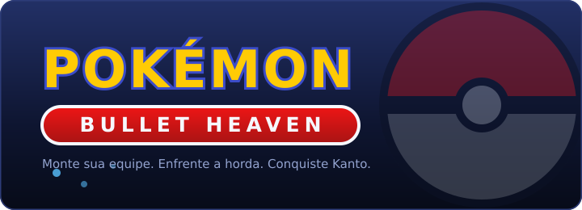

<p align="center">
  
</p>

<h1 align="center">Pokémon Bullet Heaven</h1>

<p align="center">
  <b><a href="https://fellipeperes.github.io/pokemon-bullet-heaven/">▶ JOGAR AGORA NO NAVEGADOR</a></b>
</p>

<p align="center">
  Um <i>Bullet Heaven</i> (estilo Vampire Survivors / Survivor.io) com estrutura de jornada Pokémon.<br />
  HTML + CSS + JavaScript puro. Sem instalação, sem backend, sem dependências.
</p>

---

## O jogo

Você é um treinador atravessando Kanto. **O treinador não luta** — ele só anda.
Quem combate são os **Pokémon da sua equipe**, que atacam sozinhos enquanto você
se preocupa com posicionamento, composição e build.

Cada fase é a **jornada inteira até um ginásio**: você cruza as rotas daquele
trecho enfrentando hordas de Pokémon selvagens, captura novos companheiros, sobe o
nível de cada um e, no fim, encara o **time do líder do ginásio**, um Pokémon de
cada vez, até o ace dele.

A ideia é simples: *"estou fazendo uma jornada Pokémon enquanto construo uma build
de Bullet Heaven"*. Você começa fraco, com um único inicial, e termina a fase com
uma equipe de seis, evoluída, com golpes melhorados e sinergias que você escolheu.

## Como jogar

| Ação | Tecla |
|---|---|
| Mover o treinador | `WASD` ou setas |
| Trocar o Pokémon em campo | `1` – `6` (ou clique no card) |
| Escolher qual slot ativo recebe a troca | `Tab` ou clique no card |
| Gastar os níveis acumulados de um Pokémon | botão `▲` no card |
| Pausar / fechar janela | `ESC` |

Os ataques são automáticos. O que você controla é **onde estar**, **quem está em
campo** e **quais melhorias escolher**.

> O progresso fica salvo no navegador e também pode ser exportado como arquivo
> `.json` pelo botão **Salvar Jogo** — dá para levar sua jornada para outra máquina.

## Os sistemas

**Equipe de 6, três em campo.** Os três ativos lutam ao mesmo tempo, orbitando o
treinador. Os outros três descansam e **recuperam vida** na reserva. Trocar tem
cooldown e é a principal forma de sustentar a equipe.

**Vida e nível por Pokémon.** O treinador não tem vida: quem toma dano são os
Pokémon, cada um com sua barra. Quem cai **desmaia até o fim da fase** e é
substituído automaticamente. Se os seis caírem, a fase é perdida.

**Experiência dividida.** O XP de cada inimigo é repartido pela equipe: **25% para
cada Pokémon em campo** e **8,33% para cada um da reserva**. Ninguém fica para trás,
mas quem luta cresce mais rápido.

**Melhorias a cada 3 níveis.** Pokémon ativo que sobe pausa a partida para você
escolher; o da reserva **acumula** e você gasta quando quiser, pelo botão `▲`.
As melhorias valem só para aquele Pokémon: mais dano, mais projéteis, mais área,
recarga menor, efeitos de status.

**Evolução fiel aos jogos.** Charmander vira Charmeleon no nível 16 e Charizard no
36; Bulbasaur e Squirtle seguem 16/32 e 16/36; Magikarp vira Gyarados no 20. Evoluir
mantém tudo — golpe, melhorias e proporção de vida.

**TMs — a linha de 3 golpes.** Cada espécie tem a própria linha de evolução de
golpe. Charmander é `Ember → Flamethrower → Fire Blast`; Pidgey é
`Gust → Wing Attack → Hurricane`; Machop é `Karate Chop → Seismic Toss → Cross Chop`.
Quando uma TM aparece no level up, ela sobe o golpe atual para **o próximo da linha
daquele Pokémon** — nunca um golpe aleatório de outro — e **leva junto todas as
melhorias já investidas**. Trocar de golpe nunca é um downgrade.

**Captura.** Inimigos derrotados podem deixar uma Poké Ball. Ao coletar, o jogo
pausa e oferece três Pokémon sorteados pela tabela de chances daquela fase. Cada
fase tem um teto de bolas e alguns momentos garantidos, para a jornada não depender
de sorte.

**Shards.** A moeda do jogo, ganha ao concluir fases e ao **coletar conquistas**.
Gasta na aba do Treinador em melhorias **permanentes**, que valem em todas as
partidas: velocidade, raio de coleta, sorte de Poké Ball, vida da equipe, XP e mais.

**A jornada continua.** Equipe, níveis e build passam de uma fase para a seguinte.
Perder devolve você ao início da fase com a equipe como estava ao entrar nela.

## Conteúdo atual

- **2 fases completas** — Fase 1: Rumo a Pewter (**BROCK**, Geodude + Onix) ·
  Fase 2: Rumo a Cerulean (**MISTY**, Staryu + Starmie).
- **68 Pokémon jogáveis**, cada um com linha de 3 golpes e linha evolutiva.
- **57 habilidades** sobre 7 comportamentos genéricos (projétil, arco, órbita,
  aura, zona de chão, onda de choque e raio em corrente).
- **Pokédex de Kanto** (151) que se preenche conforme você captura e evolui.
- **12 conquistas** com recompensa em Shards.
- Fases 3 a 9 (Lt. Surge → Elite Four e Campeão) já estão no mapa como próximos
  passos, com as tabelas de captura definidas.

## Rodando localmente

O jogo usa ES Modules, então precisa ser servido por HTTP (abrir o `index.html`
com duplo clique não funciona por causa do CORS).

```bash
git clone https://github.com/FellipePeres/pokemon-bullet-heaven.git
cd pokemon-bullet-heaven

npm run dev               # http://localhost:5173
# ou: python -m http.server 5173
# ou: extensão Live Server do VS Code
```

Não há dependências para instalar — `npm run dev` só sobe um servidor estático.

### Testes

```bash
npm test                  # roda os três
npm run check             # dados: evoluções, linhas de golpe, inimigos, pools
npm run smoke             # lógica: fases inteiras simuladas, sem navegador
npm run smoke:ui          # interface: DOM simulado a partir do index.html real
```

O `smoke` joga as fases do começo ao fim com um "jogador virtual" que foge da
horda, pega Poké Balls, troca Pokémon machucado e escolhe melhorias — é assim que o
balanceamento é medido.

## Estrutura

```
index.html        página única          css/style.css     interface
src/
  core/           config e utilidades   ⭐ config.js = todo o balanceamento
  data/           CONTEÚDO do jogo      ⭐ só dados, sem lógica
  entities/       treinador, Pokémon, inimigos, projéteis, áreas, itens
  systems/        comportamento genérico (combate, habilidades, spawn, equipe...)
  game/           Run (uma partida) e Game (orquestração)
  render/         canvas, sprites e ícones
  ui/             HUD, menus e modais
  save/           arquivo .json e progresso permanente
tools/            testes automatizados
```

A regra do projeto: **`/data` é conteúdo, `/systems` é comportamento**. Adicionar
um Pokémon, habilidade, inimigo, fase ou conquista é editar `/data` — os upgrades
de cada habilidade nova, por exemplo, são gerados automaticamente.

📄 **[HANDOFF.md](HANDOFF.md)** tem o estado detalhado do desenvolvimento: decisões
de design e o porquê de cada uma, balanceamento medido, armadilhas já resolvidas e
os próximos passos.

## Créditos

Sprites, ícones de item e insígnias vêm do repositório público
[PokeAPI/sprites](https://github.com/PokeAPI/sprites) — estáticos no canvas,
animados (Gen V) na interface e arte oficial nas telas grandes. Sem internet, o
jogo desenha versões procedurais e a interface cai para ícones simples.

> **Projeto de fã, sem fins lucrativos.** Pokémon e todos os nomes relacionados são
> marcas registradas da Nintendo, Game Freak e The Pokémon Company. Este projeto não
> é afiliado a elas e não é vendido nem monetizado.
